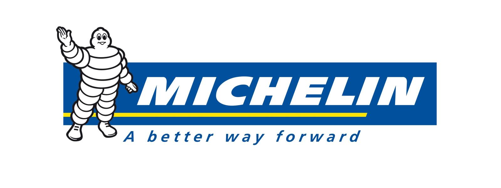
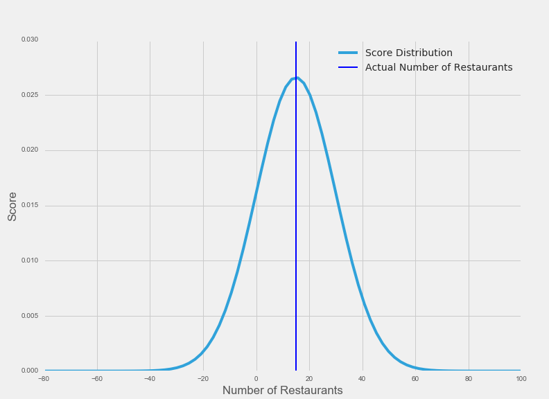
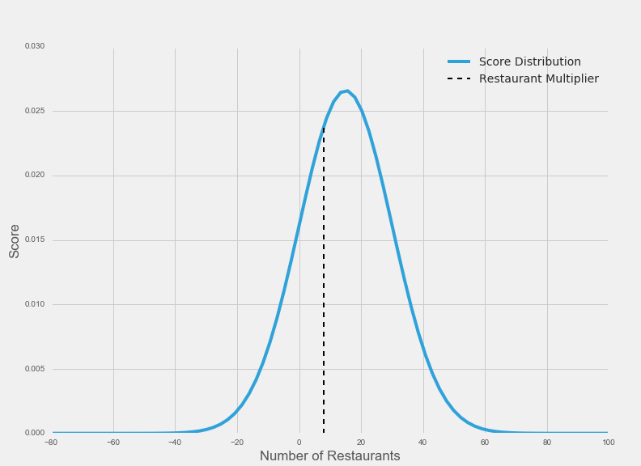
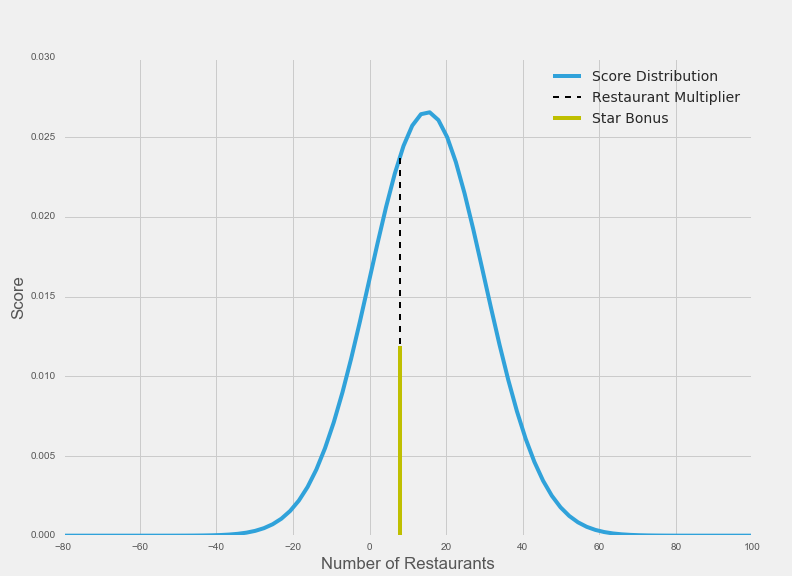

# DC Michelin Guide Challenge

## Sponsored by: General Assembly DC and The Michelin Guide
##  

The [Michelin Guide](https://en.wikipedia.org/wiki/Michelin_Guide) is a hotel and restaurant reference booklet documenting the world's most prestigious establishments. On October 13, 2016, Michelin will release a listing of restaurants in Washington, D.C. that have earned one, two, or three Michelin Stars ([Washington Post](https://www.washingtonpost.com/lifestyle/food/dcs-food-scene-gets-a-prestigious-boost-michelin-inspection-and-stars/2016/05/27/fc1db658-2132-11e6-8690-f14ca9de2972_story.html)). Michelin reviewers have been discretely sampling the DC food scene for over a year in anticipation for the release of the guide.

**Can you use data science to predict which restaurants will earn one, two, or three Michelin Stars?**

## Goal

Your goal is to use data science to produce a list of which restaurants you believe will be on the DC Michelin Guide, and how many stars each of your submitted restaurants earned. (See Submission guidelines below.) You are welcome to use any tools that you see fit: APIs, webscraping, previous city guides, other reviews, subject matter expertise, etc. Because the challenge is built to honor data scientists and developers, you will be asked to include the code and/or methods description that you utilized to generate your submission.

## Submission: Due Wednesday, October 12 by 11:59 PM

Submit a csv and code or methods description as a pull request by 10/12/16 at 11:59PM.

### How to submit:

In order to make a submission, please fork this repository to your own Github. Create a folder (within the [submissions folder](https://github.com/josephofiowa/dc-michelin-challenge/tree/master/submissions)) that is your first and last name, e.g. `josephnelson`. Include your submission materials in this folder. Create a pull request before the deadline.

(If you're not wholly comfortable with pull requests, check out this [resource](http://oss-watch.ac.uk/resources/pullrequest). Still no? Reach out to [me](https://twitter.com/josephofiowa).)

### CSV:

The [csv](SampleSubmission.csv) should include two columns:

- Restaurants (those predicted to make the list, no minimum/maximum - see scoring below)
- Stars (predicted number of stars for each, ranging from 1 to 3)

There is an example submission included.

NOTE: The guide will ONLY be covering restaurants within DC borders - not in the DMV area. Only include restaurants that will earn at least one star - Michelin honorable mentions earn no points.

### Code/Methods:

Please submit well-commented code detailing your approach. Alternatively, submit a white paper (max 2 pages) detailing the methods utilized. If opting for the latter submission, please include at least a demonstration of API use or model you may have built. Some level of technical skill is required to win the prize!

## Scoring

You'll note submissions can be of any length, restaurant, and number of stars for each submitted restaurant. (I could guess every restaurant in DC and certainly find every Michelin Star place! I could equally submit just one restaurant I am certain about, but the challenge is to find all appropriate establishments.) Because of this, scoring can be thought of as a balancing act between the length of your list (too short or too long is bad) vs the number of correct restaurants on your list.

Submissions will be scored using a [normal distribution](http://www.stat.yale.edu/Courses/1997-98/101/normal.htm), where the mean of this distribution is equal to the length of the list of one, two, or three Michelin Star restaurants in DC, and the standard deviation equals the mean. The number of restaurants you submit determines your x-axis placement on the curve. The height of the curve at that given x is the multiplier for every correct restaurant that is on your list.

The points for getting the correct number of stars for each correct restaurant follow a similar convention. You are awarded 0.5 times the height of the normal distribution at the same x-axis point determined above. In other words, a correct restaurant with a correct number of stars is 1.5 times the height of your given x-axis point.

### Scoring Example

The following is an example scoring scheme for the sample submission. Pretend 15 restaurants in DC earn at least one Michelin Star. Our scoring distribution looks like this:

 

Note that the distribution's mean is centered at 15, the length of the list of Michelin Star restaurants in DC.

As per the sample submission, you guessed 8 restaurants. Let's pretend three of your restaurants are correctly on the list. Of those three, you correctly guessed the number of stars for one of them.

Because you submitted 8 restaurants, your correct restaurant multiplier is equal to the distribution's height at x=8:

At this given point (x=8), every correct restaurant on your list is equal to 0.023852. Given you got three restaurants correct, your score is currently 3 * 0.023852 = 0.071556.

Recall that of the three restaurants you correctly predicted, you correctly predicted the number of stars one of them would earn. Your star bonus is equal to 0.5 * the height of the distribution at x=8. 0.5*0.023852 = 0.011926. Visually, this looks like:

Because you got one star predictions correct, you earn 0.011926. Your final score, thus, is 0.011926 + 0.071556 = 0.083482.

### Scoring Takeways

You want to submit a list that is closest in length AND correct answers to the true Michelin Guide. Length of your list determines your correct restaurant multiplier.

The incentive of this scoring schema is clear: you want to first guess the correct length of the list. Second, you want to correctly identify which restaurants make this list. Third, you want to guess the number of stars for those given restaurants.

## Prize

General Assembly DC and The Michelin Guide have graciously agreed to sponsor the competition. Between them, the winner earns **$500**. You're encouraged to spend this on a nice Michelin dinner! (Check out GA's part-time ga.co/2d5oiXu and full-time ga.co/2d5oiXu data science programs)

In addition, **the Michelin Guide has reserved two tickets for the winner and their +1 to attend the Michelin Guide unveiling at the French Ambassador's residence** on the evening of October 13th.

And finally, this competition will be promoted among press and tech meetups throughout DC. Performing well is an excellent way to **gain recognition within the DC tech scene**, as well as build a portfolio piece.

Thank you to [@hboyan](https://github.com/hboyan) for her help drafting this!